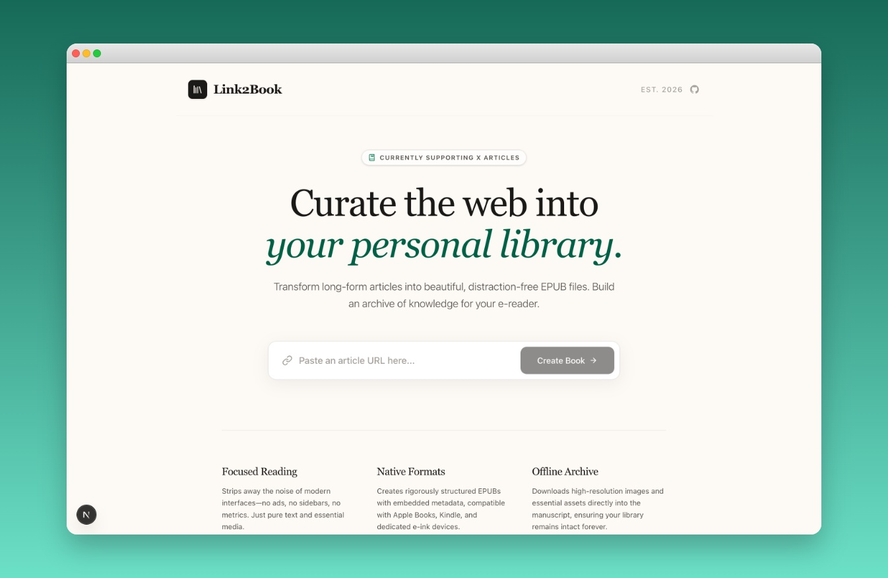

# Link2Book

> Convert X (Twitter) Article links into EPUB books.

Paste the URL of an X Article post, get a clean `.epub` file back — ready to read in Apple Books,
Kindle, or any EPUB reader.



## Features

- Live streaming conversion via SSE — watch content render in real time
- Full article extraction via Playwright + stealth (handles X's React SPA)
- EPUB 3 output with embedded images, portrait cover, and chapter TOC from headings
- Three-layer API protection: Cloudflare Turnstile, signed session cookie, CSRF header

## Quick Start

```bash
npm install
npx playwright install chromium
cp .env.example .env.local
npm run dev
```

For local dev, use Cloudflare's test keys in `.env.local` (no account needed):

```env
NEXT_PUBLIC_TURNSTILE_SITE_KEY=1x00000000000000000000AA
TURNSTILE_SECRET_KEY=1x0000000000000000000000000000000AA
SESSION_SECRET=any-random-string-for-local-dev
```

App runs at `http://localhost:3000`.

## Accepted URL Formats

```text
https://x.com/Username/status/123456789
https://x.com/Username/article/123456789
```

## Documentation

Full documentation is in [`docs/`](docs/README.md).

| Topic | Link |
| --- | --- |
| Architecture & how it works | [docs/01-architecture](docs/01-architecture/README.md) |
| Getting started & env vars | [docs/02-development/01-getting-started.md](docs/02-development/01-getting-started.md) |
| API reference & SSE events | [docs/02-development/02-api-reference.md](docs/02-development/02-api-reference.md) |
| Deployment guide | [docs/03-deployment/01-deployment-guide.md](docs/03-deployment/01-deployment-guide.md) |
| API protection (security) | [docs/04-security/01-api-protection.md](docs/04-security/01-api-protection.md) |

## Stack

- **Next.js 15** (App Router)
- **Playwright** + stealth plugin — headless browser for X's React SPA
- **JSZip** + **sharp** — custom EPUB 3 builder with image processing
- **Cloudflare Turnstile** — invisible captcha
- **Render** — Docker-based deployment (SSE streaming works out of the box)

## References

- [send-to-x4](https://github.com/Xatpy/send-to-x4) — project inspiration
- [EPUB-CSS-Editor](https://github.com/Jungliana/EPUB-CSS-Editor) — EPUB CSS reference
- [epub-css-starter-kit](https://github.com/mattharrison/epub-css-starter-kit) — EPUB CSS reference

## Status

POC — X Articles only. Output tested against Apple Books and epub-reader.online.

## License

This project is licensed under the ```MIT license``` - see the ```LICENSE``` file for details.
